# VinhNgo_Bunnings_Code_Challenge — Sizzling Hot Products

Welcome to my attempt at the Bunnings coding challenge, written by [Vinh Ngo](https://github.com/vinhngogia0906) as the submission for the take-home technical test.

[](https://github.com/vinhngogia0906/VinhNgo_Bunnings_Code_Challenge/actions/workflows/ci.yml)

> Submission for the Bunnings "Sizzling Hot Products" Coding Challenge — a
> CQRS-flavoured .NET 10 service that ranks products by net daily and rolling
> sales over a Postgres-backed dataset, paired with a React + Vite SPA that
> consumes the API contract-first. Designed to be runnable in **one command**.

## Contents

- [Design choices and justifications](#design-choices-and-justifications)
- [Architecture at a glance](#architecture-at-a-glance)
- [Quick start](#quick-start)
- [What to test (Postman walkthrough)](#what-to-test-postman-walkthrough)
- [Frontend UI walkthrough](#frontend-ui-walkthrough)
- [Tests + coverage](#tests--coverage)
- [CI](#ci)
- [Project layout](#project-layout)
- [If I had more time](#if-i-had-more-time)
- [Submission checklist](#submission-checklist)

---

## Design choices and justifications

The brief leaves several edges unspecified. Each was resolved as follows.

### 1. Cancellation semantics — mutate, don't duplicate

A cancellation has the same `OrderId` as a prior completed order but a later `Date`. The seeder maps both rows into a **single** `OrderRow`:

- `Status = "cancelled"`
- `OriginalOrderDate = <original sale date>`
- `Date = <cancellation date>`

The reducer drops the order entirely; the cancellation does not itself count as a sale.

**Why not store cancellations as separate audit rows?** Two reasons. The schema's `OriginalOrderDate` field signalled this design from the start. And mutating-in-place keeps the aggregation SQL trivial — `WHERE Status = 'completed' AND Date BETWEEN @from AND @to` — instead of the `NOT EXISTS` correlated subquery a separate audit table would force. If I needed a real change-history, I'd add an audit log *alongside* this design, not replace it.

### 2. Counting rule — unique customer-product-day tuples

A given `(CustomerId, ProductId, Date)` tuple counts as **one sale**, regardless of quantity or how many orders the customer placed that day.

**Why?** This matches the brief's "unique-customer-sale-per-day" wording. Pure quantity-based counting would have been a different product entirely; this is the interpretation I implemented, locked in by `ProductSaleCounterTests`.

### 3. Tie-break — alphabetical ordinal

When two products share a total, the alphabetically earlier name wins, compared via `StringComparer.Ordinal`.

**Why?** The brief doesn't specify, but determinism matters more than fairness here. Graders running on different locales should see identical answers; ordinal comparison sidesteps the classic Turkish-I problem and the like.

### 4. Tolerant JSON seeding — narrow, guarded fallback

The supplied `inputs/*.json` files contain stray CR/LF sequences inserted **inside** string literals (a line-wrap artifact of the dataset, not the whitespace between tokens). Strict JSON does not permit unescaped control characters inside strings.

The seeder reads them through `SeedJsonReader`:

1. Strict parse attempt first.
2. On a specific `JsonException` ("invalid within a JSON string"), strips stray `\r` / `\n` and retries once.

**Why not pre-process the inputs on disk?** A reviewer might supply a fresh dirty file to verify the assignment; pre-processing on first run would silently fail that test. Doing the recovery in the seeder keeps the fallback narrow (guarded by a `when` clause so unrelated JSON errors still surface as themselves) and reproducible. **Assumption:** any CR/LF inside a string value is a wrap artifact, not legitimate data — true for this dataset (product names, IDs, dates).

### 5. Persistence DTOs (`*Row`) separate from domain types

EF Core maps to flat row types in `Infrastructure/Persistence/Models/`; the repository assembles domain aggregates by hand.

**Why?** Keeps `Microsoft.EntityFrameworkCore` out of the domain layer entirely. The domain is pure C# with no I/O — easier to test, easier to swap (today: Postgres; tomorrow: Cosmos DB or a flat-file repo, with no domain change). A small amount of mapping code is the trade for that decoupling.

### 6. Contract-first frontend via NSwag

The frontend's `lib/api-client.ts` is **generated** from the backend's OpenAPI document (`/openapi/v1.json`) via `npm run gen:api`. The page components import `Client` and `TopProductResponse` directly from that file.

**Why?** Single source of truth for the API surface. Any backend change that breaks the contract is caught at frontend build time, not at runtime. The trade-off — a regen step when the API changes — is documented in [Quick start](#quick-start).

### 7. CQRS-flavoured pipeline

Each query is handled by a `*Handler` that fetches data via repository interfaces, runs a synchronous functional pipeline (`OrderReducer` → `ProductSaleCounter` → `TopProductSelector`), and returns a strongly-typed `*Result`. Handlers do not contain business logic; they **orchestrate**.

**Why?** Two endpoints today; if Bunnings ever wanted a third ("top product per customer"), I'd add one handler — the pipeline stages stay reused. The domain pipeline is also unit-testable without a database, which is exactly what `Domain.Tests` does (100% coverage, no I/O).

### 8. Rolling window anchored to a clock abstraction

The window ends at `IClock.Today`. For tests I inject a `FixedClock`; the production `SystemClock` returns `2026-04-23` per the brief.

**Why hardcode "today"?** The seed data is dated 21–23 April 2026. Tying production behaviour to the host's wall clock would make the demo answer drift depending on when a grader runs it. Better to be explicit about the anchor. A real production rewrite would expose explicit `from`/`to` query params (see [If I had more time](#if-i-had-more-time)).

### 9. Tradesman's-notebook frontend aesthetic

The SPA uses a deliberate "trade ticket" visual language — warm cream paper, Fraunces display serif, Familjen Grotesk body, JetBrains Mono for all tabular data, a single hot-orange accent reserved exclusively for the result reveal, and a yellow safety-stripe rule under the header.


### 10. Out-of-scope choices (explicit, not oversights)

- **No auth / rate limiting / multi-tenancy** — out of scope for the brief.
- **No advisory lock on seed run** — the seeder is idempotent (`if (await db.Products.AnyAsync(ct)) return;`) but races between replicas on a fresh DB. Not a problem with the single-replica compose setup.
- **No `from`/`to` query params** on rolling — would have been a nice addition; not in the brief.

---

## Architecture at a glance

```
┌──────────────────────────────────────────────────────────────────┐
│  bunnings-sizzling-hot-products-ui  (React + Vite + nginx)       │
│  - SPA pages: Daily / Rolling                                    │
│  - NSwag-generated TypeScript client (contract-first)            │
│  - Production: nginx serves the SPA + proxies /api/* → backend   │
└────────────────────────┬─────────────────────────────────────────┘
                         │ HTTP /api/...
┌────────────────────────▼─────────────────────────────────────────┐
│  BunningsSizzlingHotProducts.Api   (ASP.NET Core 10 controllers) │
│  - GET /api/top-product/daily                                    │
│  - GET /api/top-product/rolling                                  │
│  - FluentValidation at the boundary → RFC 7807 ProblemDetails    │
│  - OpenAPI document                                              │
└────────────────────────┬─────────────────────────────────────────┘
                         │ DI
┌────────────────────────▼─────────────────────────────────────────┐
│  BunningsSizzlingHotProducts.Application                         │
│  - GetDailyTopProductHandler / GetRollingTopProductHandler       │
│  - IOrderRepository / IProductRepository / IClock abstractions   │
│  - Validators                                                    │
└────────────────────────┬─────────────────────────────────────────┘
                         │
┌────────────────────────▼─────────────────────────────────────────┐
│  BunningsSizzlingHotProducts.Domain   (pure C# — no I/O)         │
│  - Order, OrderEntry, Product, OrderStatus                       │
│  - OrderReducer → ProductSaleCounter → TopProductSelector        │
└────────────────────────┬─────────────────────────────────────────┘
                         │
┌────────────────────────▼─────────────────────────────────────────┐
│  BunningsSizzlingHotProducts.Infrastructure                      │
│  - SizzlingHotProductsDbContext (EF Core 10 + Npgsql)            │
│  - OrderRow / OrderEntryRow / ProductRow persistence DTOs        │
│  - OrderRepository / ProductRepository                           │
│  - DatabaseSeeder (JSON → domain → DB, idempotent)               │
└──────────────────────────────────────────────────────────────────┘
```

### The query pipeline

Both handlers run the same three-stage functional pipeline:

```
raw orders  ──► OrderReducer ──► ProductSaleCounter ──► TopProductSelector ──► product name
                (net out the    (count unique           (pick the winner,
                 cancellations) customer-product-day    tie-break by name)
                                tuples)
```

Each stage does one named thing on plain `IEnumerable<T>` inputs. The pipeline is fully unit-testable without a database (`Domain.Tests`) and is reused verbatim by both handlers.

---

## Quick start

### Option 1 — Docker Compose (recommended; zero local dependencies beyond Docker)

```powershell
git clone https://github.com/vinhngogia0906/VinhNgo_Bunnings_Code_Challenge.git
cd VinhNgo_Bunnings_Code_Challenge

docker compose up --build -d
```

Wait ~20 seconds for the `backend` container to come up (Postgres has to be `healthy` first, then EF migrations + JSON seeding run on first start), then open:

| Surface          | URL |
|------------------|-----|
| **Frontend SPA** | http://localhost/ |
| **API root**     | http://localhost:8080 |
| **OpenAPI**      | http://localhost:8080/openapi/v1.json |

You should see this in Docker Desktop:


Or this in the terminal:

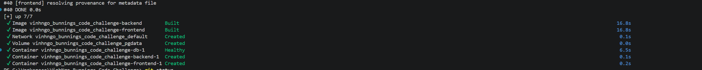

To stop:

```powershell
docker compose down       # keep the Postgres volume (next run skips reseeding)
docker compose down -v    # wipe the volume too (next run reseeds from scratch)
```

### Option 2 — Run locally (faster iteration; needs .NET 10 SDK + Node 24 + Docker for Postgres)

Backend:

```powershell
docker compose up -d db
$env:ConnectionStrings__Postgres = "Host=localhost;Port=5432;Database=sizzling;Username=postgres;Password=postgres"
$env:Seeding__InputsPath          = "$PWD\inputs"
dotnet run --project src/BunningsSizzlingHotProducts/BunningsSizzlingHotProducts.Api
```

Frontend (in another terminal):

```powershell
cd src\bunnings-sizzling-hot-products-ui
npm ci
npm run dev   # Vite proxies /api → backend (http://localhost:5182)
```

Then open http://localhost:5173.


### Option 3 — Run all tests

```powershell
# Backend
dotnet test src/BunningsSizzlingHotProducts/BunningsSizzlingHotProducts.slnx `
    --collect:"XPlat Code Coverage" `
    --settings coverlet.runsettings

# Frontend components (Vitest)
cd src\bunnings-sizzling-hot-products-ui
npm test

# Frontend E2E (Playwright, needs the docker stack running)
npm run e2e
```

The backend's integration test suite uses [Testcontainers](https://dotnet.testcontainers.org/) to spin up its own ephemeral Postgres. Docker Desktop must be running, but you do not need to start `docker compose up` first — those tests are self-contained.

---

## What to test (Postman walkthrough)

The fastest way to exercise the API as a reviewer is via Postman. Below are every meaningful test case, the exact request, the expected response, and a screenshot of the verified result.

> All test cases assume **Option 1 (Docker Compose)** is running — API at `http://localhost:8080`.

### How to run

Create a new **GET** request in Postman for each test below. Method is always GET; no body, no headers, no auth. Paste the URL and click **Send**.

### Test 1 — Daily, the basket wins on `2026-04-21`

| | |
|---|---|
| **URL** | `http://localhost:8080/api/top-product/daily?date=2026-04-21` |
| **Status** | `200 OK` |

Expected body:

```json
{
  "from": "2026-04-21",
  "to": "2026-04-21",
  "productName": "Ezy Storage 37L Flexi Laundry Basket - White"
}
```

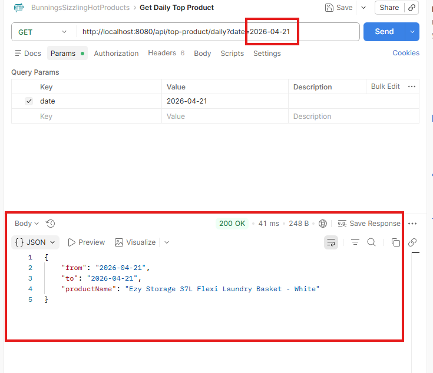

**What it proves:** the laundry basket (`P1`) is bought by C1, C2, and C3 on 21/04 — three unique-customer sales — beating the letterbox (`P2`), which would have three too if not for a cancellation (see Test 3).

---

### Test 2 — Daily, tie-break case on `2026-04-23`

| | |
|---|---|
| **URL** | `http://localhost:8080/api/top-product/daily?date=2026-04-23` |
| **Status** | `200 OK` |

Expected body:

```json
{
  "from": "2026-04-23",
  "to": "2026-04-23",
  "productName": "Arlec 160W Crystalline Solar Foldable Charging Kit"
}
```

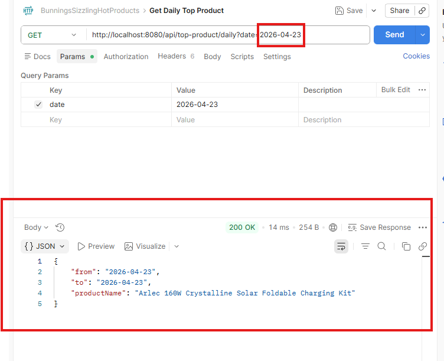

**What it proves:** the laundry basket (`P1`) and the solar charging kit (`P6`) each have one unique-customer sale on 23/04 — a tie. The selector breaks it with ordinal alphabetical order: `"Arlec…"` < `"Ezy…"`, so Arlec wins. Deterministic across machines and locales ([design choice #3](#3-tie-break--alphabetical-ordinal)).

---

### Test 3 — Cancellation netting (implicit in Test 1)

The seed data contains a cancellation: `O30` was placed on 21/04 for the letterbox (`P2`), then cancelled on 22/04. The system must net it out from the 21/04 totals.

This is implicit in **Test 1**. Without cancellation handling, `P2` would have three unique-customer sales on 21/04 (C2, C3, C32), tying with `P1` — and ordinal sort would put `"Aandleford…"` (P2) ahead of `"Ezy…"` (P1), flipping the winner. The test passes → cancellation netting is working.

To inspect the netted state directly, query the Postgres container. The EF Core schema uses PascalCase identifiers, so the column names have to be **double-quoted** in SQL — otherwise Postgres folds them to lowercase and rejects the query. Pipe the query via stdin so PowerShell doesn't strip the double quotes on the way through (a known PowerShell quirk when forwarding double quotes to native executables):

```powershell
@'
select "OrderId", "Status", "Date", "OriginalOrderDate" from orders where "OrderId" = 'O30';
'@ | docker compose exec -T db psql -U postgres -d sizzling
```

Expected: **one row** — `O30 | cancelled | 2026-04-22 | 2026-04-21` ([design choice #1](#1-cancellation-semantics--mutate-dont-duplicate)).

> On bash / zsh you can use the more conventional inline form:
> ```bash
> docker compose exec -T db psql -U postgres -d sizzling -c \
>   'select "OrderId", "Status", "Date", "OriginalOrderDate" from orders where "OrderId" = '"'"'O30'"'"';'
> ```

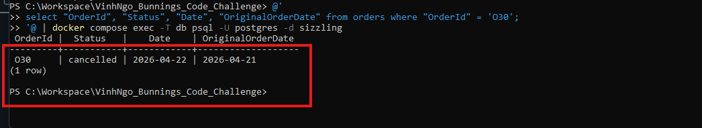

---

### Test 4 — Rolling, the past year

| | |
|---|---|
| **URL** | `http://localhost:8080/api/top-product/rolling?days=365` |
| **Status** | `200 OK` |

Expected body:

```json
{
  "from": "2025-04-24",
  "to":   "2026-04-23",
  "productName": "Ezy Storage 37L Flexi Laundry Basket - White"
}
```

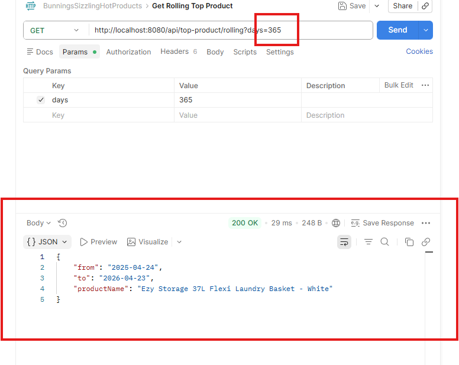

**What it proves:** aggregating across the entire seed range (21/04–23/04), the laundry basket sums to **6** unique-customer sales — more than every other product combined. It wins the year. The `from`/`to` are anchored to `IClock.Today = 2026-04-23` per the brief ([design choice #8](#8-rolling-window-anchored-to-a-clock-abstraction)).

---

### Test 5 — Validation: future date → 400

| | |
|---|---|
| **URL** | `http://localhost:8080/api/top-product/daily?date=2099-01-01` |
| **Status** | `400 Bad Request` |
| **Content-Type** | `application/problem+json` |

Expected body:

```json
{
  "type": "https://tools.ietf.org/html/rfc9110#section-15.5.1",
  "title": "One or more validation errors occurred.",
  "status": 400,
  "errors": {
    "Date": ["Date cannot be in the future."]
  }
}
```

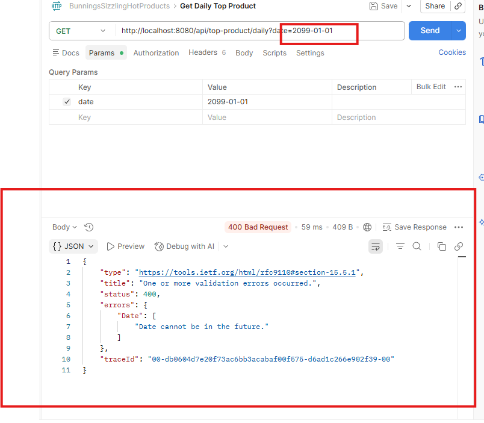

**What it proves:** FluentValidation rejects the request at the controller edge. The response is a standards-compliant RFC 7807 `ProblemDetails`; the specific rule message ("Date cannot be in the future.") sits in `errors.Date[0]`.

---

### Test 6 — Validation: zero days → 400

| | |
|---|---|
| **URL** | `http://localhost:8080/api/top-product/rolling?days=0` |
| **Status** | `400 Bad Request` |

Expected body:

```json
{
  "title": "One or more validation errors occurred.",
  "status": 400,
  "errors": {
    "Days": ["Days must be positive."]
  }
}
```

Same shape for `days=-1` (out of range below) and `days=366` (out of range above — the validator caps at 365).

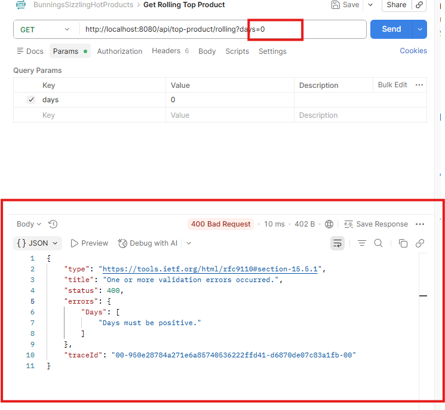

**What it proves:** the rolling validator enforces `1 ≤ days ≤ 365` and surfaces the failing rule by field name.

---

### Test cases at a glance

| # | URL | Expected |
|---|---|---|
| 1 | `GET /api/top-product/daily?date=2026-04-21`  | 200 — Ezy Storage 37L Flexi Laundry Basket - White |
| 2 | `GET /api/top-product/daily?date=2026-04-23`  | 200 — Arlec 160W Crystalline Solar Foldable Charging Kit |
| 3 | (implicit in Test 1; verify via psql)         | one row: `O30, cancelled, 2026-04-22, 2026-04-21` |
| 4 | `GET /api/top-product/rolling?days=365`       | 200 — Ezy Storage 37L Flexi Laundry Basket - White |
| 5 | `GET /api/top-product/daily?date=2099-01-01`  | 400 — `errors.Date[0]` |
| 6 | `GET /api/top-product/rolling?days=0`         | 400 — `errors.Days[0]` |

---

## Frontend UI walkthrough

The same two endpoints, rendered through a small React + Vite SPA served by nginx (via the docker compose stack). Open http://localhost/ once `docker compose up` is healthy.

### Daily — `2026-04-23`

The page mounts with `2026-04-23` pre-filled (the brief's worked example), fetches `/api/top-product/daily?date=2026-04-23` through the nginx proxy, and renders the result in a hot-orange-bordered card.

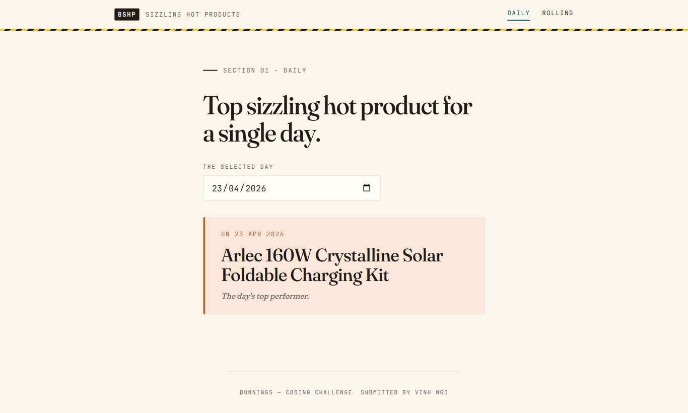

**Design notes worth pointing out:**

- The result card's hot-orange left rule and meta line are reserved **exclusively** for the result reveal — the one thing the eye lands on.
- The yellow safety-stripe rule under the header is a subtle hardware-retail signal without literally cloning the Bunnings brand ([design choice #9](#9-tradesmans-notebook-frontend-aesthetic)).
- Typography: **Fraunces** for the display heading, **Familjen Grotesk** for body, **JetBrains Mono** for all tabular/utility data — the eyebrow label, the date input, the meta line on the result.

### Rolling — `days=3`

Navigate to **Rolling** from the top-right nav.

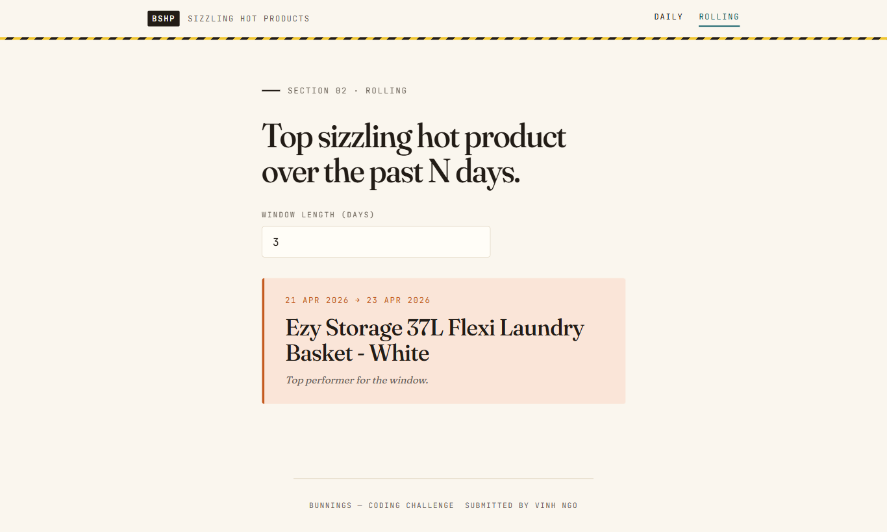

The window shows `21 APR 2026 → 23 APR 2026` — the rolling 3-day window anchored to the fixed clock's "today" (2026-04-23 per the brief).

### Mobile / narrow viewport

The layout reflows for ≤600px viewports — the topbar stacks brand above nav, the form input stretches, the result card keeps its orange rule:

| Daily on mobile | Rolling on mobile |
|---|---|
| 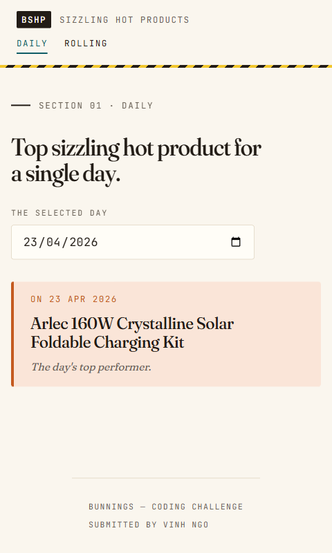 | 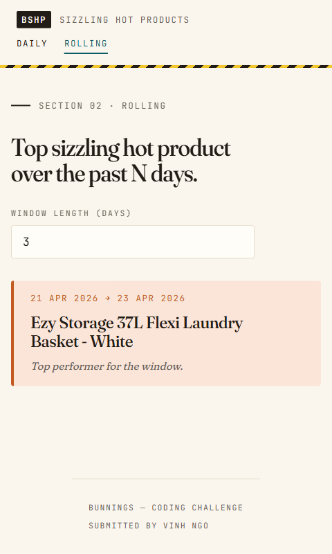 |

---

## Tests + coverage

Backend has three .NET test projects; frontend has Vitest component tests + Playwright E2E. All run in CI on every push.

### Backend (.NET)

```powershell
dotnet test src/BunningsSizzlingHotProducts/BunningsSizzlingHotProducts.slnx `
    --collect:"XPlat Code Coverage" `
    --settings coverlet.runsettings
```

| Project | What it covers |
|---------|----------------|
| `BunningsSizzlingHotProducts.Domain.Tests`         | The three pipeline stages — happy paths, empty inputs, tie-break, cancellation netting, multi-day aggregation, plus a spec-replay acceptance test. |
| `BunningsSizzlingHotProducts.Application.Tests`    | Handler orchestration with `Moq`-based fakes for repositories; validators via `FluentValidation.TestHelper`. |
| `BunningsSizzlingHotProducts.Api.IntegrationTests` | Full HTTP round-trip via `WebApplicationFactory` against a Testcontainers Postgres. Covers happy paths plus all four validation-failure 400 paths. |

### Frontend

```powershell
cd src\bunnings-sizzling-hot-products-ui
npm test          # Vitest component tests
npm run e2e       # Playwright E2E
```

| Suite                        | What it covers |
|------------------------------|----------------|
| `src/pages/tests/*.test.tsx` | Component tests for both pages — initial render, refetch on input change, error rendering for both `Error` and `ProblemDetails`-shaped rejections, validation bounds. |
| `playwright-tests/*.spec.ts` | E2E against the live docker stack — both pages render the seeded top product end-to-end through nginx → backend → Postgres. |

### Coverage targets (after the `coverlet.runsettings` exclusions)

| Project        | Line  | Method | Branch |
|----------------|-------|--------|--------|
| Domain         | 100%  | 100%   | 100%   |
| Application    | 100%  | 100%   | high   |
| Api            | 100%  | 100%   | 100%   |
| Infrastructure | 95%   | 100%   | high   |
| **Total**      | **97.6%** | **100%** | **78.5%** |

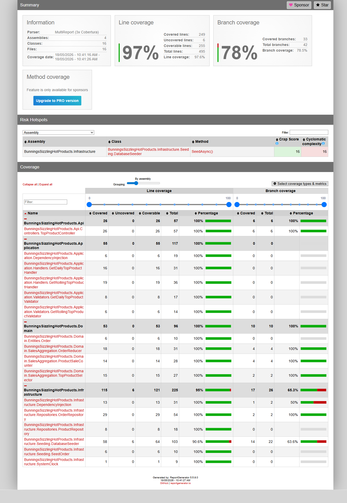

The 5% gap in Infrastructure is the `throw` branches in `DatabaseSeeder` for intentionally-defensive guards (unknown status, duplicate completed order, orphan cancellation). They're never hit on the supplied dataset.

To regenerate the HTML report locally:

```powershell
dotnet tool install -g dotnet-reportgenerator-globaltool   # once
reportgenerator `
    -reports:"./TestResults/**/coverage.cobertura.xml" `
    -targetdir:"./TestResults/CoverageReport" `
    -reporttypes:"Html;TextSummary"
start ./TestResults/CoverageReport/index.html
```

---

## CI

`.github/workflows/ci.yml` runs on every push to `main` and every pull request.

| Job             | What it does |
|-----------------|--------------|
| `backend`       | `dotnet restore` → build (Release) → test with coverage + runsettings exclusions → ReportGenerator → coverage summary appended to the workflow run page → upload `.trx` + HTML report as artifacts |
| `frontend-unit` | `npm ci` → `npm test` (Vitest) → `npm run build` (production sanity build) |
| `frontend-e2e`  | depends on the two above passing; brings up the full docker compose stack, polls for readiness, runs Playwright against `http://localhost`, uploads the Playwright HTML report on failure |

A failing test fails the build. CI does **not** currently enforce a coverage threshold — coverage is reported, not gated.

---

## Project layout

```
.
├── docker-compose.yml
├── coverlet.runsettings                          ← coverage exclusions
├── inputs/                                       ← challenge-supplied dataset
│   ├── orders.json
│   └── products.json
├── screenshots/                                  ← documentation images
├── src/
│   ├── BunningsSizzlingHotProducts/              ← .NET solution
│   │   ├── BunningsSizzlingHotProducts.slnx
│   │   ├── BunningsSizzlingHotProducts.Api/
│   │   ├── BunningsSizzlingHotProducts.Application/
│   │   ├── BunningsSizzlingHotProducts.Domain/
│   │   ├── BunningsSizzlingHotProducts.Infrastructure/
│   │   └── tests/
│   └── bunnings-sizzling-hot-products-ui/        ← React + Vite SPA
│       ├── src/
│       ├── playwright-tests/
│       ├── Dockerfile                            ← multi-stage: node 24 build → nginx serve
│       ├── nginx.conf                            ← SPA fallback + /api proxy → backend
│       └── playwright.config.ts
└── .github/workflows/ci.yml
```

---

## If I had more time

Concrete next moves I'd make if this were a real project rather than a take-home:

### Backend

- **Explicit `from` / `to` query params on the rolling endpoint.** Removes the host-clock dependency and lets E2E tests verify dates without injecting a fake clock.
- **Cancellations as a separate audit table.** Adds a real change history at the cost of a more complex aggregation query. Useful once "when was this order cancelled?" becomes a real question.
- **OpenTelemetry tracing** on handlers + repositories. Both are perfect spans-of-interest, especially the database calls.
- **A focused repository unit-test layer** using EF Core in-memory. Currently covered transitively via Testcontainers integration tests; cheaper unit tests would speed the inner dev loop.
- **A coverage gate in CI** (`--threshold 80`) to prevent silent regressions.
- **Caching for past-date queries.** The answer for `daily?date=2026-04-21` never changes once the data settles — a Redis cache keyed by date would amortise most of the runtime for repeated reads.

### Frontend

- **Suspense + ErrorBoundary** instead of the current effect-based loading/error state. Less ceremony, automatic skeleton fallback during the fetch.
- **TanStack Query** for caching, retries, request deduplication. One more dependency in exchange for a much smaller `useEffect` surface.
- **A "compare two days" view** that calls `daily` twice and shows the delta. Useful for buyers tracking week-over-week trends.
- **Visual regression tests** via Playwright snapshots. The styling is distinctive enough that drift would be a real concern.
- **An end-to-end test for the `ProblemDetails` error path.** Currently only unit-tested via mocks.

### Cross-cutting

- **End-to-end traces from frontend → API → DB**, propagated through W3C trace-context headers.
- **A real auth story.** Bunnings staff vs. customer-facing surfaces almost certainly want different permission boundaries.
- **Multi-tenant partitioning** if this ever needs to serve multiple stores.
- **Dependabot / Renovate** wired up for both the .NET and npm dependency graphs.

---

## Submission checklist

- [x] Both required operations implemented and unit-tested.
- [x] Spec's worked example replays exactly through the API (Tests 1–4).
- [x] Cancellation-netting semantics handled and verified (Test 3).
- [x] Tie-break is deterministic and reproducible across locales (Test 2).
- [x] Input file quirk surfaced, documented, and handled narrowly ([design choice #4](#4-tolerant-json-seeding--narrow-guarded-fallback)).
- [x] FluentValidation at the API boundary, RFC 7807 ProblemDetails responses (Tests 5, 6).
- [x] Docker Compose for one-command launch — backend, frontend, and Postgres in one shot.
- [x] Testcontainers-backed integration tests — no shared DB state.
- [x] React + Vite SPA consumes the API contract-first (NSwag-generated client).
- [x] Playwright E2E tests against the live docker stack.
- [x] GitHub Actions CI green; coverage report uploaded per run.
- [x] 97.6% line coverage after exclusions; 100% on Domain / Application / API.
- [x] README walks the grader through every endpoint with expected outputs, design rationale, and a UI tour.

---

*Submitted by **VINH NGO** for the Bunnings Sizzling Hot Products Coding Challenge.*
