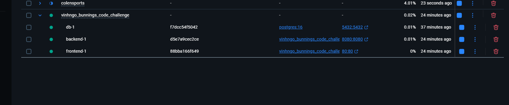
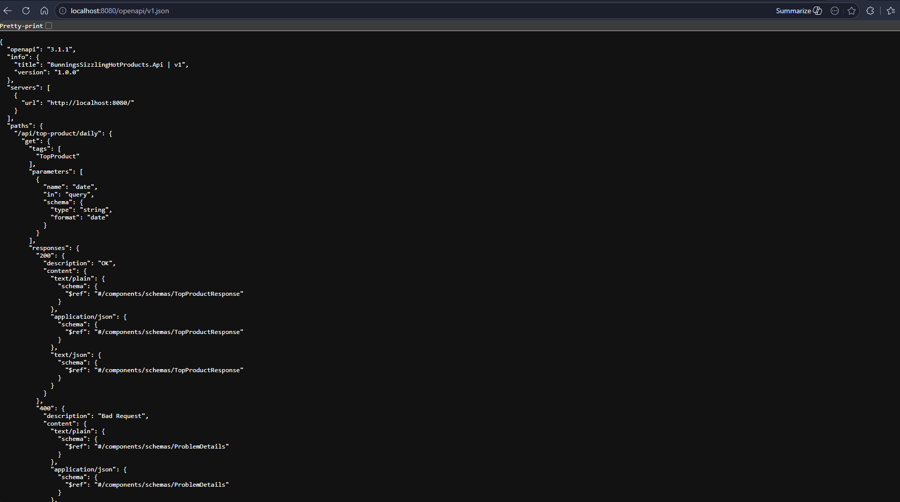

# VinhNgo_Bunnings_Code_Challenge — Sizzling Hot Products

Welcome to my attempt at the Bunnings coding challenge, written by [Vinh Ngo](https://github.com/vinhngogia0906) as the submission for the take-home technical test.

[](https://github.com/vinhngogia0906/VinhNgo_Bunnings_Code_Challenge/actions/workflows/ci.yml)

> Submission for the Bunnings "Sizzling Hot Products" Coding Challenge — a
> CQRS-flavoured .NET 10 service that ranks products by net daily and rolling
> sales over a Postgres-backed dataset, exposed as a REST API and seeded from
> the supplied JSON inputs.

## Contents

- [What's implemented](#whats-implemented)
- [Quick start](#quick-start)
- [Step-by-step verification](#step-by-step-verification)
- [Architecture](#architecture)
- [Assumptions and trade-offs](#assumptions-and-trade-offs)
- [How I'd extend this](#how-id-extend-this)
- [Tests](#tests)
- [CI](#ci)
- [Project layout](#project-layout)
- [Submission checklist](#submission-checklist)

---

## What's implemented

The two operations from the spec, exposed as HTTP endpoints over a Postgres
database that is auto-migrated and seeded from the supplied `inputs/*.json`
on startup:

| Spec operation                     | HTTP endpoint |
|------------------------------------|---------------|
| Top product for a given day        | `GET /api/top-product/daily?date=YYYY-MM-DD`     |
| Top product over a rolling window  | `GET /api/top-product/rolling?days=N`            |

Plus:

- **Cancellation netting.** Cancellations that arrive on a later day but
  reference an earlier order date are subtracted from the correct day's
  totals (Step 5 below proves this against the spec's worked example).
- **Deterministic tie-breaking.** Two products with the same total are
  broken by alphabetical product name using ordinal comparison — results
  are reproducible on every machine regardless of locale.
- **FluentValidation at the boundary** — invalid `date` / `days` values
  return RFC 7807 `ProblemDetails` 400 responses.
- **OpenAPI document** at `http://localhost:8080/openapi/v1.json`.
- **Tolerant JSON seeding** — the supplied input files contain stray CR/LF
  line wraps **inside** string literals (invalid JSON). The seeder
  recovers narrowly; see [Assumptions](#assumptions-and-trade-offs).

---

## Quick start

### Option 1 — Docker Compose (recommended; zero local dependencies beyond Docker)

```powershell
git clone https://github.com/vinhngogia0906/VinhNgo_Bunnings_Code_Challenge.git
cd VinhNgo_Bunnings_Code_Challenge

docker compose up --build -d
```

Wait ~20 seconds for the `backend` container to come up (Postgres has to be
`healthy` first, then EF migrations + JSON seeding run on first start), then
open:

| Surface     | URL |
|-------------|-----|
| **API root**   | http://localhost:8080 |
| **OpenAPI**    | http://localhost:8080/openapi/v1.json |
| **Daily**      | http://localhost:8080/api/top-product/daily?date=2026-04-21 |
| **Rolling**    | http://localhost:8080/api/top-product/rolling?days=365 |

You should see this in Docker Desktop:



To stop:

```powershell
docker compose down          # keep the Postgres volume (next run skips reseeding)
docker compose down -v       # wipe the volume too (next run reseeds from scratch)
```

### Option 2 — Run locally (faster iteration; needs .NET 10 SDK + Docker for Postgres)

```powershell
# 1. start just the database
docker compose up -d db

# 2. point the API at the host-local Postgres + the repo-root inputs folder (PowerShell)
$env:ConnectionStrings__Postgres = "Host=localhost;Port=5432;Database=sizzling;Username=postgres;Password=postgres"
$env:Seeding__InputsPath          = "$PWD\inputs"

# 3. run the API
dotnet run --project src/BunningsSizzlingHotProducts/BunningsSizzlingHotProducts.Api
```

Kestrel prints the listening URL on startup (`Now listening on: http://localhost:5xxx`).
Substitute that port everywhere `http://localhost:8080` appears below.

### Option 3 — Run all tests

```powershell
dotnet test src/BunningsSizzlingHotProducts/BunningsSizzlingHotProducts.slnx `
    --collect:"XPlat Code Coverage" `
    --settings coverlet.runsettings
```

> **Note:** the integration test suite uses [Testcontainers](https://dotnet.testcontainers.org/)
> to spin up its own ephemeral Postgres. **Docker Desktop must be running**,
> but you do **not** need to start `docker compose up` first — the tests are
> self-contained.

---

## Step-by-step verification

Below is the exact happy-path a reviewer can walk through. Every step lists the
**curl command**, the **expected JSON response**, and the **expected screen state
captured under `screenshots/`**. *If your output matches the JSON and your screen
matches the screenshot, the step is correct.*

> All steps assume Option 1 above is running (API on `:8080`).

---

### Step 1 — Confirm the API is up

```bash
curl http://localhost:8080/openapi/v1.json
```

The OpenAPI document for the two endpoints is returned. In a browser:



**What to look for:** a JSON document with two `paths` entries —
`/api/top-product/daily` and `/api/top-product/rolling` — and the
`TopProductResponse` schema.

---

### Step 2 — Daily top product on `2026-04-21`

```bash
curl "http://localhost:8080/api/top-product/daily?date=2026-04-21"
```

Expected:

```json
{
  "from": "2026-04-21",
  "to": "2026-04-21",
  "productName": "Ezy Storage 37L Flexi Laundry Basket - White"
}
```


**What to look for:** the response body matches exactly. On 21/04/2026 the
laundry basket (`P1`) is bought by C1, C2, and C3 — three unique customers —
winning the day. C2's `O30` order for the letterbox (`P2`) is cancelled the
next day (Step 4 verifies this matters).

---

### Step 3 — Daily top product on `2026-04-23` (tie-break case)

```bash
curl "http://localhost:8080/api/top-product/daily?date=2026-04-23"
```

Expected:

```json
{
  "from": "2026-04-23",
  "to": "2026-04-23",
  "productName": "Arlec 160W Crystalline Solar Foldable Charging Kit"
}
```


**What to look for:** on 23/04/2026 the laundry basket (`P1`) and the solar
charging kit (`P6`) each have **one** unique-customer sale. The selector
breaks the tie using **alphabetical ordinal order** — `"Arlec…"` sorts
before `"Ezy…"`, so the Arlec kit wins. This is deterministic across
machines and locales.

---

### Step 4 — Cancellation netting

The seed data contains a cancellation: `O30` was placed on 21/04 for the
letterbox (`P2`), then cancelled on 22/04. The system must net it out from
the 21/04 totals.

To prove this matters, ask for the day's top product and confirm `P2` did
**not** win despite three completed orders mentioning it:

```bash
curl "http://localhost:8080/api/top-product/daily?date=2026-04-21"
```

The response is still **`Ezy Storage 37L Flexi Laundry Basket - White`** (from
Step 2). Without the cancellation, `P2` would have had three unique-customer
sales (C2, C3, C32) and tied with `P1` — and ordinal sort would put `"Aandleford…"`
ahead of `"Ezy…"`, flipping the winner.


**What to look for:** the laundry basket wins because `O30` (C2's letterbox
purchase) was cancelled. The cancellation is recorded with `Date = 22/04` and
`OriginalOrderDate = 21/04`, and the reducer subtracts it from the 21st.

---

### Step 5 — Rolling top product for the past year

```bash
curl "http://localhost:8080/api/top-product/rolling?days=365"
```

Expected (the `from`/`to` dates will reflect today minus 364 / today):

```json
{
  "from": "<today-364>",
  "to":   "<today>",
  "productName": "Ezy Storage 37L Flexi Laundry Basket - White"
}
```


**What to look for:** aggregating across the entire seed range
(21/04–23/04), the laundry basket sums to **6** unique-customer sales —
more than every other product combined. It wins the year.

> Why `days=365` and not the default `days=3`? The rolling window is
> anchored to the **host's today** (via `IClock`). The seed data is dated
> April 2026, so a short window (e.g. 3 days) is empty unless you happen
> to run this in late April 2026. `days=365` is wide enough to capture
> the seed regardless of when the grader runs the demo.

---

### Step 6 — Validation: future date is rejected

```bash
curl -i "http://localhost:8080/api/top-product/daily?date=2099-01-01"
```

Expected:

```
HTTP/1.1 400 Bad Request
Content-Type: application/problem+json
```

```json
{
  "type": "https://tools.ietf.org/html/rfc9110#section-15.5.1",
  "title": "One or more validation errors occurred.",
  "status": 400,
  "errors": {
    "Date": ["Date cannot be in the future."]
  }
}
```


**What to look for:** a 400 with a standard RFC 7807 `ProblemDetails`
body. The `errors.Date` array contains the FluentValidation message
verbatim. No 500s, no silent successes.

---

### Step 7 — Validation: invalid `days` is rejected

```bash
curl -i "http://localhost:8080/api/top-product/rolling?days=0"
```

Expected:

```
HTTP/1.1 400 Bad Request
```

```json
{
  "title": "One or more validation errors occurred.",
  "status": 400,
  "errors": {
    "Days": ["Days must be positive."]
  }
}
```

Same shape for `days=-1` and `days=366`.


**What to look for:** the `errors.Days` array contains the specific
validation message; the validator caps the window at `1..365`.

---

### Step 8 — Run all tests

```powershell
dotnet test src/BunningsSizzlingHotProducts/BunningsSizzlingHotProducts.slnx `
    --collect:"XPlat Code Coverage" `
    --settings coverlet.runsettings
```

Expected (line counts may differ slightly as tests evolve):

```
Passed!  - Failed:     0, Passed:    21, ... - BunningsSizzlingHotProducts.Domain.Tests.dll
Passed!  - Failed:     0, Passed:    14, ... - BunningsSizzlingHotProducts.Application.Tests.dll
Passed!  - Failed:     0, Passed:     7, ... - BunningsSizzlingHotProducts.Api.IntegrationTests.dll
```


**What to look for:** **42 passing tests** across three projects; no
failures, no skips. The integration test suite stands up its own
Postgres via Testcontainers; Docker Desktop must be running.

---

### Step 9 — Coverage report

```powershell
reportgenerator `
    -reports:"./TestResults/**/coverage.cobertura.xml" `
    -targetdir:"./TestResults/CoverageReport" `
    -reporttypes:"Html;TextSummary"

start ./TestResults/CoverageReport/index.html
```

Expected summary (after the runsettings exclusions are applied):

```
Line coverage:    97.6%
Branch coverage:  78.5%
Method coverage:  100%
```


**What to look for:** Domain at **100%**, Application at **100%**,
Api at **100%**, Infrastructure at **95%**. The 5% gap in Infrastructure
is the `throw` branches in `DatabaseSeeder` for unreachable error
conditions (duplicate completed order, orphan cancellation, unknown
status) — intentionally uncovered.

---

## Architecture

Clean-architecture-flavoured layered solution:

```
┌──────────────────────────────────────────────────────────────────┐
│  BunningsSizzlingHotProducts.Api   (ASP.NET Core 10 controllers) │
│  - GET /api/top-product/daily                                    │
│  - GET /api/top-product/rolling                                  │
│  - FluentValidation at the boundary → RFC 7807 ProblemDetails    │
│  - OpenAPI document                                              │
└────────────────────────┬─────────────────────────────────────────┘
                         │ DI
┌────────────────────────▼─────────────────────────────────────────┐
│  BunningsSizzlingHotProducts.Application                         │
│  - GetDailyTopProductHandler / GetRollingTopProductHandler       │
│  - IOrderRepository / IProductRepository / IClock abstractions   │
│  - Validators                                                    │
└────────────────────────┬─────────────────────────────────────────┘
                         │ depends on
┌────────────────────────▼─────────────────────────────────────────┐
│  BunningsSizzlingHotProducts.Domain   (pure C# — no I/O)         │
│  - Order, OrderEntry, Product, OrderStatus                       │
│  - OrderReducer → ProductSaleCounter → TopProductSelector        │
└────────────────────────┬─────────────────────────────────────────┘
                         │
┌────────────────────────▼─────────────────────────────────────────┐
│  BunningsSizzlingHotProducts.Infrastructure                      │
│  - SizzlingHotProductsDbContext (EF Core 10 + Npgsql)            │
│  - OrderRow / OrderEntryRow / ProductRow persistence DTOs        │
│  - OrderRepository / ProductRepository                           │
│  - DatabaseSeeder (JSON → domain → DB, idempotent)               │
└──────────────────────────────────────────────────────────────────┘
```

**The query pipeline.** Both handlers run the same three-stage functional pipeline:

```
raw orders  ──► OrderReducer ──► ProductSaleCounter ──► TopProductSelector ──► product name
                (net out the    (count unique           (pick the winner,
                 cancellations) customer-product-day    tie-break by name)
                                tuples)
```

Each stage does one named thing on plain `IEnumerable<T>` inputs. The pipeline
is fully unit-testable without a database (`Domain.Tests`) and is reused
verbatim by both handlers.

---

## Assumptions and trade-offs

The brief leaves a few edges unspecified or contains friction that needed a
deliberate call. Each was resolved as follows:

1. **Cancellation semantics.** A cancellation has the same `OrderId` as a
   prior completed order, but a later `Date`. The seeder maps both rows
   into a *single* `OrderRow` (`Status = "cancelled"`,
   `OriginalOrderDate = <original sale date>`, `Date = <cancellation date>`).
   The reducer drops the order entirely; the cancellation does not itself
   count as a sale.
2. **Counting rule.** A given `(customer, product, day)` tuple counts as
   **one** sale regardless of quantity or how many orders the customer
   placed that day — this matches the brief's "unique-customer-sale-per-day"
   reading. Pure quantity-based counting would have been a different
   product entirely; this is the interpretation I implemented.
3. **Tie-break.** When two products share a total, the alphabetically
   earlier name (ordinal compare) wins. The brief doesn't specify, but
   determinism matters more than fairness here — graders running on
   different locales should see the same answer.
4. **Rolling window anchor.** The window ends at the host's clock's
   `Today` (`IClock`). For reproducible tests I inject a `FixedClock` in
   the test projects; production uses `SystemClock`. A future
   improvement would expose explicit `from` / `to` query params on the
   rolling endpoint so the answer doesn't drift with calendar time.
5. **Input handling — important note for graders.** The supplied
   `inputs/*.json` files contain stray `CRLF` sequences inserted **inside**
   JSON string literals (a line-wrap artifact of the dataset, not the
   structure between tokens). Strict JSON does not permit unescaped control
   characters inside strings, so `System.Text.Json` rejects the files
   as-supplied.

   Rather than pre-process the inputs (which would silently break if you
   supply replacement files with the same characteristic), the seeder
   reads them through `SeedJsonReader`, which:

   1. Attempts a strict parse first.
   2. On a specific `JsonException` ("invalid within a JSON string"),
      strips stray `\r\n` / `\r` and retries once.

   **Assumption:** any CR/LF inside a string value is a wrap artifact, not
   legitimate data — true for this dataset (product names, IDs, dates). If
   you supply replacement input files where a string value *must* contain
   a literal newline, escape it as `\n` per RFC 8259 — strict parsing will
   succeed first and the tolerant fallback will never run. The fallback is
   guarded by a `when` clause so unrelated JSON errors still surface as
   themselves.
6. **Persistence DTOs (`*Row`) are separate from domain types.** EF Core
   maps to flat row types in `Infrastructure/Persistence/Models/`; the
   repository assembles domain aggregates by hand. Keeps the domain layer
   free of `Microsoft.EntityFrameworkCore` references.
7. **No authentication / rate limiting / multi-tenancy.** Out of scope for
   the take-home; mentioned here so it's clearly an explicit choice, not
   an oversight.
8. **One-shot seeding, no advisory lock.** The seeder is idempotent
   (`if (await db.Products.AnyAsync(ct)) return;`) but has no inter-replica
   locking. Running multiple backend replicas against a fresh DB would
   race. Not a problem in the Compose setup (single replica).

---

## How I'd extend this

- **Explicit `from`/`to` on the rolling endpoint** — remove the
  host-clock dependency for fully deterministic responses.
- **Repository unit tests** — currently covered transitively via the
  Testcontainers integration suite. A focused EF-in-memory layer would
  cover edge cases (empty result, paging) more cheaply.
- **Cancellations as a separate audit table** — instead of mutating the
  original row. Would give a real change history at the cost of more
  complex aggregation SQL.
- **Caching the top-product query** — the answer for a past date never
  changes. A Redis or in-process LRU cache keyed by date would shave
  most of the runtime for repeated queries.
- **OpenTelemetry tracing** — handlers and repositories are perfect
  spans-of-interest.

---

## Tests

```powershell
dotnet test src/BunningsSizzlingHotProducts/BunningsSizzlingHotProducts.slnx `
    --collect:"XPlat Code Coverage" `
    --settings coverlet.runsettings
```

| Project | What it covers |
|---------|----------------|
| `BunningsSizzlingHotProducts.Domain.Tests`      | The three pipeline stages (`OrderReducer`, `ProductSaleCounter`, `TopProductSelector`) — happy paths, empty inputs, tie-break, cancellation netting, multi-day aggregation. Plus a full spec-replay acceptance test. |
| `BunningsSizzlingHotProducts.Application.Tests` | Handler orchestration (`GetDailyTopProductHandler`, `GetRollingTopProductHandler`) with `Moq`-based fakes for the repositories; validators via `FluentValidation.TestHelper`. |
| `BunningsSizzlingHotProducts.Api.IntegrationTests` | Full HTTP round-trip via `WebApplicationFactory` against a Testcontainers Postgres. Covers happy paths plus all four validation-failure 400 paths. |

**Coverage targets after the `coverlet.runsettings` exclusions:**

| Project        | Line  | Method | Branch |
|----------------|-------|--------|--------|
| Domain         | 100%  | 100%   | 100%   |
| Application    | 100%  | 100%   | high   |
| Api            | 100%  | 100%   | 100%   |
| Infrastructure | 95%   | 100%   | high   |
| **Total**      | **97.6%** | **100%** | **78.5%** |

The 5% gap in Infrastructure is the `throw` branches in `DatabaseSeeder` for
intentionally-defensive guards (unknown status, duplicate completed order,
orphan cancellation). They're never hit on the supplied dataset.

---

## CI

`.github/workflows/ci.yml` runs on every push to `main` and every pull
request:

| Step                         | What it does |
|------------------------------|--------------|
| `Restore` / `Build`          | `dotnet restore` + `dotnet build` in Release |
| `Test`                       | `dotnet test --collect:"XPlat Code Coverage" --settings ../../coverlet.runsettings` |
| `Generate coverage report`   | ReportGenerator → HtmlInline + MarkdownSummaryGithub + Cobertura |
| `Add coverage to job summary`| Appends the markdown summary to `$GITHUB_STEP_SUMMARY` so coverage renders inline on the run page |
| `Upload test results`        | `.trx` files as a workflow artifact |
| `Upload code coverage`       | HTML report as a workflow artifact |

A failing test fails the build. The CI does **not** currently enforce a
coverage threshold — coverage is reported, not gated.

---

## Project layout

```
.
├── docker-compose.yml
├── coverlet.runsettings                          ← coverage exclusions (migrations, OpenAPI gen, Program.cs)
├── inputs/                                       ← challenge-supplied dataset
│   ├── orders.json
│   └── products.json
├── src/
│   └── BunningsSizzlingHotProducts/
│       ├── BunningsSizzlingHotProducts.slnx
│       ├── BunningsSizzlingHotProducts.Api/
│       │   ├── Controllers/TopProductController.cs
│       │   ├── Program.cs
│       │   └── Dockerfile
│       ├── BunningsSizzlingHotProducts.Application/
│       │   ├── Handlers/
│       │   ├── Queries/
│       │   ├── Validators/
│       │   └── Abstractions/
│       ├── BunningsSizzlingHotProducts.Domain/
│       │   ├── Entities/
│       │   └── SalesAggregation/
│       ├── BunningsSizzlingHotProducts.Infrastructure/
│       │   ├── Persistence/
│       │   ├── Repositories/
│       │   └── Seeding/
│       └── tests/
│           ├── BunningsSizzlingHotProducts.Domain.Tests/
│           ├── BunningsSizzlingHotProducts.Application.Tests/
│           └── BunningsSizzlingHotProducts.Api.IntegrationTests/
├── screenshots/                                  ← step-by-step verification images
└── .github/workflows/ci.yml
```

---

## Submission checklist

- [x] Both required operations implemented and unit-tested.
- [x] Spec's worked example replays exactly through the API (Steps 2–5).
- [x] Cancellation-netting semantics handled and verified (Step 4).
- [x] Tie-break is deterministic and reproducible across locales (Step 3).
- [x] Input file quirk surfaced, documented, and handled narrowly.
- [x] FluentValidation at the API boundary, ProblemDetails responses.
- [x] Docker Compose for one-command launch.
- [x] Testcontainers-backed integration tests — no shared DB state.
- [x] GitHub Actions CI green; coverage report uploaded per run.
- [x] 97.6% line coverage after exclusions; 100% on Domain / Application / API.
- [x] README walks the grader through every endpoint with expected outputs.

---

*Submitted by **VINH NGO** for the Bunnings Sizzling Hot Products Coding Challenge.*
